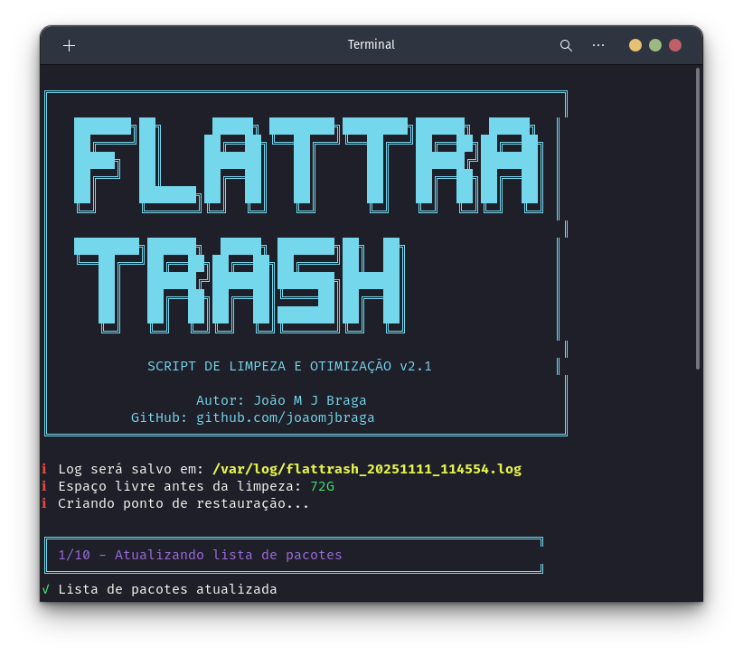

# 🗑️ FlatTrash

<div align="center">



**Script completo de limpeza e otimização para sistemas Linux baseados em Debian/Ubuntu/Pop!\_OS**

[](https://opensource.org/licenses/MIT)
[](https://www.gnu.org/software/bash/)
[](https://github.com/joaomjbraga/flattrash)

</div>

---

## 📋 Sobre o Projeto

**FlatTrash** é um script bash poderoso projetado para automatizar a limpeza e otimização de sistemas Linux. Ele remove pacotes desnecessários, limpa caches, arquivos temporários e libera espaço em disco de forma segura e eficiente.

Desenvolvido e testado no **Pop!\_OS**, mas compatível com qualquer distribuição baseada em Debian/Ubuntu.

### ✨ Características

- 📊 **Relatórios Detalhados** - Estatísticas em tempo real sobre espaço liberado
- 🔍 **Análise Completa** - Verifica e remove múltiplos tipos de arquivos desnecessários
- ✅ **Seguro e Confiável** - Verificações de segurança antes de executar operações críticas
- 🚀 **Automatizado** - Executa todas as tarefas de limpeza com um único comando
- 📦 **Suporte Flatpak & Snap** - Limpeza especializada para aplicações Flatpak e Snap
- 📝 **Sistema de Logs** - Registra todas as operações em arquivo de log
- 💾 **Backup Automático** - Cria ponto de restauração antes da limpeza
- 🔄 **Tratamento de Erros** - Gestão robusta de erros e falhas

---

## 🎯 O Que o Script Faz

O FlatTrash executa as seguintes operações de limpeza em 10 etapas:

1. **Atualização de Pacotes** - Atualiza a lista de pacotes disponíveis
2. **Remoção de Dependências** - Remove pacotes e dependências não utilizadas (`apt autoremove`)
3. **Limpeza de Cache APT** - Limpa arquivos de cache do gerenciador de pacotes (`apt clean` e `apt autoclean`)
4. **Remoção de Órfãos** - Identifica e remove pacotes órfãos com deborphan
5. **Configurações Residuais** - Remove configurações de pacotes desinstalados
6. **Limpeza Flatpak** - Remove aplicações Flatpak não utilizadas e repara instalações
7. **Otimização Snap** - Remove versões antigas de snaps desabilitados
8. **Logs do Sistema** - Limpa logs com journalctl (mantém últimos 7 dias ou máx 100MB)
9. **Cache de Usuário** - Limpa ~/.cache (arquivos +30 dias) e miniaturas de todos os usuários
10. **Cache do Sistema** - Limpa /var/cache, /tmp, /var/tmp e caches Python/npm

### 🔧 Otimizações Adicionais

- Limpeza do cache do man
- Atualização do database do locate
- Remoção de logs compactados antigos (.gz, .log.\*)
- Limpeza de cache pip e npm

---

## 🚀 Instalação e Uso

### Pré-requisitos

- Sistema Linux baseado em Debian/Ubuntu (testado no Pop!\_OS)
- Acesso root (sudo)
- Bash 4.0 ou superior
- Conexão com internet (recomendada)

### Instalação

```bash
# Clone o repositório
git clone https://github.com/joaomjbraga/flattrash.git

# Entre no diretório
cd flattrash

# Dê permissão de execução
chmod +x flattrash.sh
```

### Executando o Script

```bash
# Execute com privilégios de root
sudo ./flattrash.sh
```

O script irá:

1. Verificar se está sendo executado como root
2. Verificar conexão com internet
3. Exibir um banner informativo
4. Criar backup da lista de pacotes instalados
5. Mostrar o espaço livre atual
6. Executar todas as 10 operações de limpeza
7. Apresentar um relatório final com estatísticas
8. Perguntar se deseja reiniciar o sistema

### 📝 Sistema de Logs

Todos os logs são salvos automaticamente em:

```
/var/log/flattrash_YYYYMMDD_HHMMSS.log
```

O arquivo de log contém:

- Timestamp de cada operação
- Status (SUCCESS, WARNING, ERROR)
- Detalhes de todas as operações executadas

---

## 📸 Captura de Tela


---

## 🛡️ Segurança

O FlatTrash foi projetado com segurança em mente:

- ✅ Verifica se está sendo executado como root
- ✅ Cria backup da lista de pacotes antes de limpar
- ✅ Usa `set -euo pipefail` para melhor tratamento de erros
- ✅ Usa operações seguras do APT com `--purge` e `--auto-remove`
- ✅ Remove apenas arquivos temporários e caches seguros
- ✅ Mantém logs recentes (7 dias) e limita tamanho (100MB)
- ✅ Limpa apenas arquivos de cache com +30 dias de idade
- ✅ Não remove pacotes do sistema críticos
- ✅ Função `safe_remove` para evitar erros em diretórios inexistentes
- ✅ Verifica existência de comandos antes de usá-los

---

## 📊 Exemplo de Saída

```
╔═══════════════════════════════════════════════════════════╗
║                                                           ║
║   ███████╗██╗      █████╗ ████████╗████████╗██████╗      ║
║   ██╔════╝██║     ██╔══██╗╚══██╔══╝╚══██╔══╝██╔══██╗     ║
║   █████╗  ██║     ███████║   ██║      ██║   ██████╔╝     ║
║   ██╔══╝  ██║     ██╔══██║   ██║      ██║   ██╔══██╗     ║
║   ██║     ███████╗██║  ██║   ██║      ██║   ██║  ██║     ║
║   ╚═╝     ╚══════╝╚═╝  ╚═╝   ╚═╝      ╚═╝   ╚═╝  ╚═╝     ║
║                                                           ║
║   ████████╗██████╗  █████╗ ███████╗██╗  ██╗              ║
║   ╚══██╔══╝██╔══██╗██╔══██╗██╔════╝██║  ██║              ║
║      ██║   ██████╔╝███████║███████╗███████║              ║
║      ██║   ██╔══██╗██╔══██║╚════██║██╔══██║              ║
║      ██║   ██║  ██║██║  ██║███████║██║  ██║              ║
║      ╚═╝   ╚═╝  ╚═╝╚═╝  ╚═╝╚══════╝╚═╝  ╚═╝              ║
║                                                           ║
║            SCRIPT DE LIMPEZA E OTIMIZAÇÃO v2.1           ║
║                                                           ║
║                  Autor: João M J Braga                    ║
║          GitHub: github.com/joaomjbraga                   ║
╚═══════════════════════════════════════════════════════════╝

ℹ Log será salvo em: /var/log/flattrash_20241111_143022.log
ℹ Espaço livre antes da limpeza: 15.2G

╔═══════════════════════════════════════════════════════════╗
║                   RELATÓRIO FINAL                         ║
╠═══════════════════════════════════════════════════════════╣
║ Espaço livre antes:  15.2G (15GB)
║ Espaço livre agora:  18.7G (18GB)
║ Espaço liberado:    3GB
║
║ Log completo salvo em:
║ /var/log/flattrash_20241111_143022.log
╚═══════════════════════════════════════════════════════════

✓ Sistema otimizado e limpo!
ℹ Recomenda-se reiniciar o sistema para aplicar todas as mudanças
```

---

## 🔧 Personalização

Você pode personalizar o script editando as seguintes variáveis e seções:

```bash
# Tempo de retenção de logs (padrão: 7 dias ou 100MB)
journalctl --vacuum-time=7d
journalctl --vacuum-size=100M

# Idade dos arquivos de cache a remover (padrão: 30 dias)
find "$HOME/.cache" -type f -atime +30 -delete

# Idade dos arquivos temporários (padrão: 2 dias em /tmp, 7 dias em /var/tmp)
find /tmp -type f -atime +2 -delete
find /var/tmp -type f -atime +7 -delete

# Cores da interface (variáveis no início do script)
readonly RED='\033[0;31m'
readonly GREEN='\033[0;32m'
readonly YELLOW='\033[1;33m'
readonly BLUE='\033[0;34m'
readonly PURPLE='\033[0;35m'
readonly CYAN='\033[0;36m'
```

---

## 🤝 Contribuindo

Contribuições são bem-vindas! Sinta-se à vontade para:

1. Fazer um Fork do projeto
2. Criar uma branch para sua feature (`git checkout -b feature/NovaFuncionalidade`)
3. Commit suas mudanças (`git commit -m 'Adiciona nova funcionalidade'`)
4. Push para a branch (`git push origin feature/NovaFuncionalidade`)
5. Abrir um Pull Request

### 💡 Ideias para Contribuição

- Suporte para outras distribuições Linux (Fedora, Arch, etc.)
- Modo interativo para escolher quais limpezas executar
- Opção de dry-run (simular sem executar)
- Relatórios em HTML ou JSON
- Agendamento automático via cron

---

## 📝 Changelog

### Versão 2.1 (Atual)

- 🔒 Melhor tratamento de erros com `set -euo pipefail`
- 📝 Sistema de logs completo com timestamps
- 💾 Backup automático da lista de pacotes
- 🌐 Verificação de conexão com internet
- 🧹 Limpeza de cache de múltiplos usuários
- 🔧 Limpeza de cache Python (pip) e npm
- 📊 Estatísticas mais detalhadas durante execução
- ⚠️ Melhor tratamento de warnings e erros
- 🔄 Função `safe_remove` para operações mais seguras
- 📦 Suporte completo para Snap (remoção de versões antigas)
- 🗑️ Limpeza de logs compactados (.gz, .log.\*)
- 🔍 Atualização do database do locate

### Versão 2.0

- ✨ Interface visual completamente redesenhada
- 📊 Adicionado relatório de espaço liberado
- 🎨 Cores e ícones para melhor visualização
- 📈 Estatísticas detalhadas durante a execução
- 🚀 Opção de reiniciar o sistema ao final
- 🧹 Limpeza adicional de thumbnails e /tmp

### Versão 1.0

- 🎯 Versão inicial com funcionalidades básicas

---

## ⚠️ Aviso

Este script foi desenvolvido e testado no **Pop!\_OS 22.04**, mas é compatível com outras distribuições baseadas em Debian/Ubuntu. Use por sua conta e risco. Sempre faça backup de dados importantes antes de executar scripts de limpeza do sistema.

O script cria automaticamente um backup da lista de pacotes instalados em `/var/backups/flattrash_packages_backup_YYYYMMDD.txt` antes de executar qualquer operação.

---

## 🐛 Problemas Conhecidos

Se você encontrar problemas:

1. Verifique os logs em `/var/log/flattrash_*.log`
2. Certifique-se de ter conexão com internet
3. Verifique se tem privilégios de root (sudo)
4. Alguns avisos (warnings) são normais e não indicam falha

---

## 📄 Licença

Este projeto está sob a licença MIT. Veja o arquivo [LICENSE](LICENSE) para mais detalhes.

---

## 👤 Autor

**João M J Braga**

- GitHub: [@joaomjbraga](https://github.com/joaomjbraga)
- Projeto: [FlatTrash](https://github.com/joaomjbraga/flattrash)

---

## 🌟 Mostre seu Apoio

Se este projeto foi útil para você, considere dar uma ⭐️!

---

## 📚 FAQ

**P: O script é seguro?**
R: Sim! O script usa apenas comandos oficiais do sistema e remove apenas arquivos temporários e caches. Ele também cria um backup antes de executar.

**P: Posso usar em produção?**
R: Recomendamos testar em ambiente de desenvolvimento primeiro. O script é seguro, mas cada sistema é único.

**P: Com que frequência devo executar?**
R: Depende do uso. Recomendamos executar mensalmente ou quando notar que o espaço está baixo.

**P: O script remove arquivos importantes?**
R: Não. O script remove apenas caches, arquivos temporários e pacotes não utilizados. Dados do usuário nunca são tocados.

**P: Preciso reiniciar após executar?**
R: Recomendamos reiniciar para aplicar todas as mudanças, mas não é obrigatório.

---

<div align="center">

**Mantenha seu sistema Linux limpo e otimizado!** 🚀

</div>
