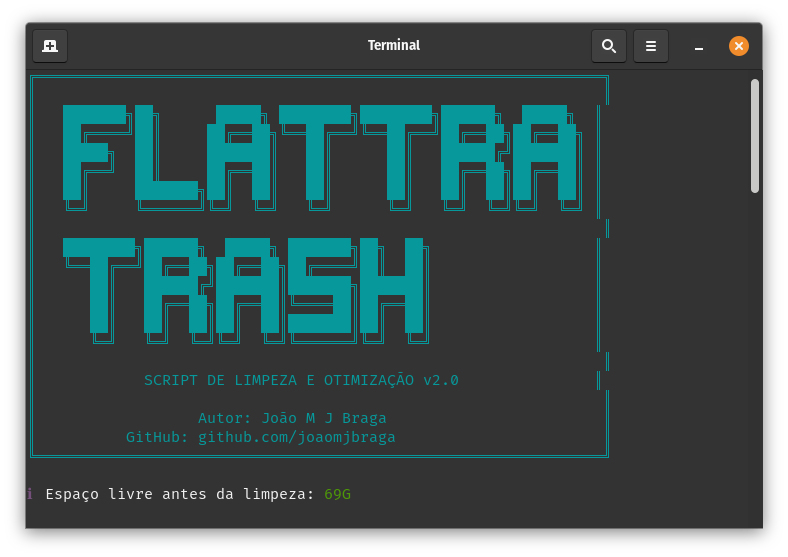

# 🗑️ FlatTrash

<div align="center">



**Script completo de limpeza e otimização para sistemas Linux baseados em Debian/Ubuntu/Pop!\_OS**

[](https://opensource.org/licenses/MIT)
[](https://www.gnu.org/software/bash/)
[](https://github.com/joaomjbraga/flattrash)

</div>

---

## 📋 Sobre o Projeto

**FlatTrash** é um script bash poderoso projetado para automatizar a limpeza e otimização de sistemas Linux. Ele remove pacotes desnecessários, limpa caches, arquivos temporários e libera espaço em disco de forma segura e eficiente.

Desenvolvido e testado no **Pop!\_OS**, mas compatível com qualquer distribuição baseada em Debian/Ubuntu.

### ✨ Características

- 📊 **Relatórios Detalhados** - Estatísticas em tempo real sobre espaço liberado
- 🔍 **Análise Completa** - Verifica e remove múltiplos tipos de arquivos desnecessários
- ✅ **Seguro e Confiável** - Verificações de segurança antes de executar operações críticas
- 🚀 **Automatizado** - Executa todas as tarefas de limpeza com um único comando
- 📦 **Suporte Flatpak** - Limpeza especializada para aplicações Flatpak

---

## 🎯 O Que o Script Faz

O FlatTrash executa as seguintes operações de limpeza:

1. **Atualização de Pacotes** - Atualiza a lista de pacotes disponíveis
2. **Remoção de Dependências** - Remove pacotes e dependências não utilizadas
3. **Limpeza de Cache APT** - Limpa arquivos de cache do gerenciador de pacotes
4. **Remoção de Órfãos** - Identifica e remove pacotes órfãos com deborphan
5. **Configurações Residuais** - Remove configurações de pacotes desinstalados
6. **Limpeza Flatpak** - Remove aplicações Flatpak não utilizadas e repara instalações
7. **Logs do Sistema** - Remove logs antigos (mantém últimos 7 dias)
8. **Cache de Usuário** - Limpa ~/.cache e miniaturas
9. **Cache do Sistema** - Limpa /var/cache e arquivos temporários

---

## 🚀 Instalação e Uso

### Pré-requisitos

- Sistema Linux baseado em Debian/Ubuntu (testado no Pop!\_OS)
- Acesso root (sudo)
- Bash 4.0 ou superior

### Instalação

```bash
# Clone o repositório
git clone https://github.com/joaomjbraga/flattrash.git

# Entre no diretório
cd flattrash

# Dê permissão de execução
chmod +x flattrash.sh
```

### Executando o Script

```bash
# Execute com privilégios de root
sudo ./flattrash.sh
```

O script irá:

1. Exibir um banner informativo
2. Mostrar o espaço livre atual
3. Executar todas as operações de limpeza
4. Apresentar um relatório final com estatísticas
5. Perguntar se deseja reiniciar o sistema

---

## 📸 Captura de Tela


---

## 🛡️ Segurança

O FlatTrash foi projetado com segurança em mente:

- ✅ Verifica se está sendo executado como root
- ✅ Usa operações seguras do APT
- ✅ Remove apenas arquivos temporários e caches seguros
- ✅ Mantém logs recentes (7 dias)
- ✅ Não remove pacotes do sistema críticos

---

## 📊 Exemplo de Saída

```
╔═══════════════════════════════════════════════════════════════╗
║                   RELATÓRIO FINAL                             ║
╠═══════════════════════════════════════════════════════════════╣
║ Espaço livre antes:  15.2G
║ Espaço livre agora:  18.7G
╚═══════════════════════════════════════════════════════════════╝

✓ Sistema otimizado e limpo!
ℹ Recomenda-se reiniciar o sistema para aplicar todas as mudanças
```

---

## 🔧 Personalização

Você pode personalizar o script editando as seguintes variáveis:

```bash
# Tempo de retenção de logs (padrão: 7 dias)
journalctl --vacuum-time=7d

# Adicionar mais operações de limpeza
# Insira seu código nas seções apropriadas
```

---

## 🤝 Contribuindo

Contribuições são bem-vindas! Sinta-se à vontade para:

1. Fazer um Fork do projeto
2. Criar uma branch para sua feature (`git checkout -b feature/NovaFuncionalidade`)
3. Commit suas mudanças (`git commit -m 'Adiciona nova funcionalidade'`)
4. Push para a branch (`git push origin feature/NovaFuncionalidade`)
5. Abrir um Pull Request

---

## 📝 Changelog

### Versão 2.0 (Atual)

- ✨ Interface visual completamente redesenhada
- 📊 Adicionado relatório de espaço liberado
- 🎨 Cores e ícones para melhor visualização
- 🔍 Estatísticas detalhadas durante a execução
- 🚀 Opção de reiniciar o sistema ao final
- 🧹 Limpeza adicional de thumbnails e /tmp

### Versão 1.0

- 🎯 Versão inicial com funcionalidades básicas

---

## ⚠️ Aviso

Este script foi desenvolvido e testado no **Pop!\_OS 22.04**, mas é compatível com outras distribuições baseadas em Debian/Ubuntu. Use por sua conta e risco. Sempre faça backup de dados importantes antes de executar scripts de limpeza do sistema.

---

## 📄 Licença

Este projeto está sob a licença MIT. Veja o arquivo [LICENSE](LICENSE) para mais detalhes.

---

## 👤 Autor

**João M J Braga**

- GitHub: [@joaomjbraga](https://github.com/joaomjbraga)
- Projeto: [FlatTrash](https://github.com/joaomjbraga/flattrash)

---

## 🌟 Mostre seu Apoio

Se este projeto foi útil para você, considere dar uma ⭐️!

---

<div align="center">

**Mantenha seu sistema Linux limpo e otimizado!** 🚀

</div>
